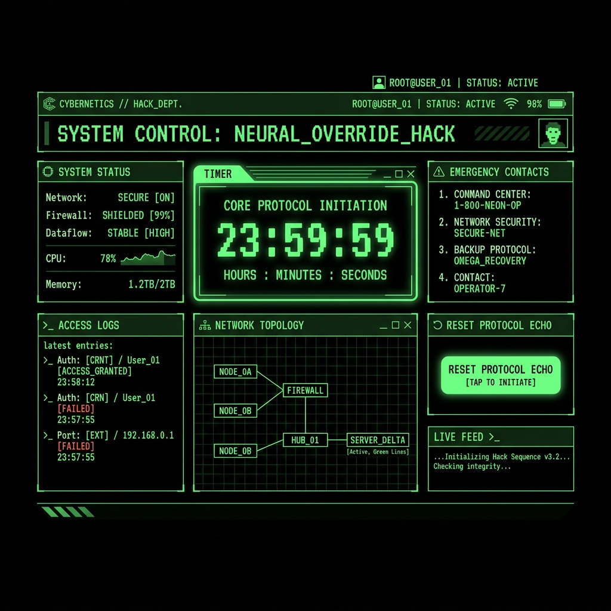

# 💀 Dead Man's Switch
> **O guardião cibernético da sua existência digital.**



## 📌 Sobre o Projeto
O **Dead Man's Switch** (Gatilho de Homem Morto) é um sistema de emergência passivo desenhado para proteger e alertar pessoas de confiança caso você fique incapacitado ou desapareça.

Inspirado em painéis de hackers cyberpunk e terminais retro de tubo (CRT), o sistema exige que você "resete" um contador periodicamente (o *Protocolo ECHO*). Se o contador chegar a zero, o sistema deduz que algo aconteceu com você e dispara automaticamente mensagens críticas com instruções de emergência para todos os seus contatos previamente cadastrados.

---

## 🚀 Funcionalidades Principais

- **⏳ Protocolo ECHO (Timer)**: Um contador em regressão (ex: 72 horas) que você deve resetar manualmente. 
- **📞 Múltiplos Contatos de Emergência**: Cadastre até 3 pessoas de confiança. Cada contato pode receber o alerta por **E-mail** e **Telegram**.
- **🚨 Alertas Automatizados**: Dispara um aviso preventivo faltando 10 minutos para o timer zerar e um Alerta Crítico Definitivo quando atinge o zero absoluto.
- **✉️ Mensagens Customizáveis**: Deixe mensagens diferentes e confidenciais para cada um dos seus contatos.
- **🛡️ Segurança Máxima**: Sistema protegido com login por e-mail, senha criptografada e suporte a **Autenticação de Dois Fatores (2FA)** via aplicativo (Google Authenticator, Authy, etc).
- **🕹️ Easter Egg (Modo Pânico)**: Um gatilho manual oculto (Konami Code: `Cima, Cima, Cima, Baixo`) no painel de configurações para acionar o protocolo imediatamente em caso de perigo iminente.

---

## 🛠️ Tecnologias Utilizadas

O sistema foi construído utilizando as seguintes ferramentas do ecossistema de desenvolvimento web moderno:

- **Next.js (App Router)** - Framework React para renderização e rotas otimizadas.
- **Supabase** - Backend as a Service (BaaS) provendo Autenticação (Auth), Banco de Dados PostgreSQL e gerenciamento de permissões (RLS).
- **Tailwind CSS** - Estilização utility-first, responsável pela temática Cyberpunk/Matrix.
- **Resend** - API utilizada para o disparo confiável de E-mails de emergência.
- **Telegram Bot API** - Integração direta para o disparo de mensagens via mensageiro instantâneo.
- **Lucide React** - Biblioteca leve e consistente de ícones.

---

## ⚙️ Como Usar (Guia de Instalação Local)

Deseja rodar sua própria instância do Dead Man's Switch localmente ou modificá-lo? Siga os passos abaixo:

### Pré-requisitos
- [Node.js](https://nodejs.org/en/) (Versão 18+)
- [npm](https://www.npmjs.com/) (Gerenciador de pacotes)
- Conta no [Supabase](https://supabase.com/)
- Conta no [Resend](https://resend.com/)
- Um Bot do Telegram (criado via [@BotFather](https://t.me/BotFather))

### 1. Clonar o Repositório
```bash
git clone https://github.com/JeffersonJr/Dead-Man-s-Switch.git
cd Dead-Man-s-Switch
```

### 2. Instalar Dependências
```bash
npm install
```

### 3. Configurar Variáveis de Ambiente
Crie um arquivo chamado `.env.local` na raiz do projeto e preencha com as suas chaves e tokens:
```env
# Supabase
NEXT_PUBLIC_SUPABASE_URL=seu_url_do_supabase
NEXT_PUBLIC_SUPABASE_ANON_KEY=sua_anon_key_do_supabase
SUPABASE_SERVICE_ROLE_KEY=sua_service_role_key

# Resend (Emails)
RESEND_API_KEY=sua_chave_do_resend

# Telegram Bot
TELEGRAM_BOT_TOKEN=seu_token_do_telegram_bot
TELEGRAM_CHAT_ID=seu_chat_id_pessoal_para_testes
```

### 4. Rodar o Servidor de Desenvolvimento
Inicie a aplicação no seu ambiente local (ela ficará disponível em `http://localhost:3000`):
```bash
npm run dev
```

*Nota: Se você já rodou o comando acima no seu terminal, basta acessar [http://localhost:3000](http://localhost:3000) no seu navegador!*

---

## 🗄️ Estrutura do Banco de Dados (Supabase)

Se estiver configurando um projeto novo no Supabase, certifique-se de ter as seguintes tabelas:

1. **`profiles`**: Dados básicos do operador (full_name, phone).
2. **`counter_status`**: Armazena o timer. Campos principais: `deadline`, `warning_10m_sent`, `email_enviado`.
3. **`notification_targets`**: Contatos. Campos principais: `type` ('email' ou 'telegram'), `destination_value`, `target_name`, `message`.

---

## 📜 Licença

Desenvolvido para segurança e paz de espírito. Uso pessoal e privado.
